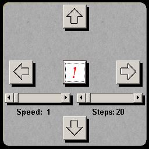



## Menu Cube

### Description

Creating a nice animated menu made from different forms...
 
### More Info
 

             |
---                |---
**Submitted On**   |2005-04-05 00:27:00
**By**             |[Axi Nadee](https://github.com/Planet-Source-Code/PSCIndex/blob/master/ByAuthor/axi-nadee.md)
**Level**          |Beginner
**User Rating**    |4.7 (14 globes from 3 users)
**Compatibility**  |VB 3\.0, VB 4\.0 \(16\-bit\), VB 4\.0 \(32\-bit\), VB 5\.0, VB 6\.0
**Category**       |[Custom Controls/ Forms/  Menus](https://github.com/Planet-Source-Code/PSCIndex/blob/master/ByCategory/custom-controls-forms-menus__1-4.md)
**World**          |[Visual Basic](https://github.com/Planet-Source-Code/PSCIndex/blob/master/ByWorld/visual-basic.md)
**Archive File**   |[Menu\_Cube1875384112005\.zip](https://github.com/Planet-Source-Code/axi-nadee-menu-cube__1-59947/archive/master.zip)

